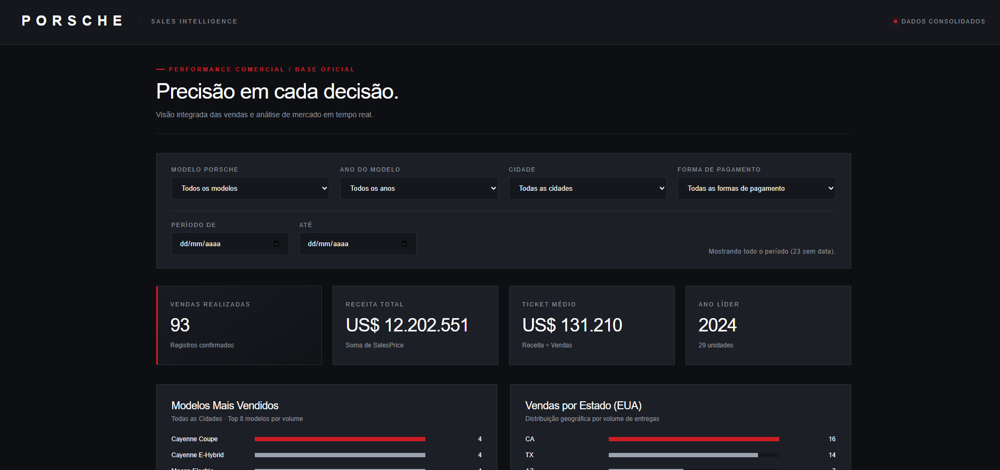

<div align="center">

# PORSCHE | Sales Intelligence Dashboard

### Precisão em cada decisão.

**Projeto de estudo em análise de dados, Business Intelligence e Inteligência Artificial**  
**DIO × Santander**

[](https://frtop87.github.io/dash_porsche_html/)
[](https://github.com/frtop87/dash_porsche_html)


</div>

---

## 1. Sobre o projeto

Este projeto foi desenvolvido como atividade prática de estudo da **DIO em parceria com o Santander**, explorando o uso do **ChatGPT com Canvas** na criação de um dashboard analítico em HTML.

O objetivo foi transformar uma base de vendas de veículos Porsche em informações visuais úteis à **tomada de decisão gerencial**, permitindo investigar desempenho comercial por modelo, cidade, estado, ano-modelo e forma de pagamento.

A proposta combina análise de dados, definição de perguntas de negócio, engenharia de prompt e refinamento de interface, com uma identidade visual inspirada no [site oficial da Porsche Brasil](https://www.porsche.com/brazil/pt/).

> **Acesse o projeto publicado:** https://frtop87.github.io/dash_porsche_html/

## 2. Prévia da dashboard




## 3. Perguntas de negócio escolhidas — e por quê

Foram selecionadas quatro perguntas consideradas mais assertivas para apoiar decisões gerenciais, por conectarem **demanda, distribuição geográfica, volume de vendas e receita**.

| Pergunta | Objetivo da análise | Apoio à decisão |
|---|---|---|
| **Quais são os principais modelos vendidos por cidade?** | Identificar a preferência de modelos em cada mercado local. | Orientar o mix de produtos e as ações comerciais por região. |
| **Qual ano-modelo vendeu mais em determinado período, por volume e por receita?** | Comparar quantidade vendida e faturamento gerado por ano-modelo. | Identificar líderes de demanda e de receita, que nem sempre são os mesmos. |
| **Quais insights de popularidade surgem na cidade selecionada?** | Destacar modelos líderes e sua participação no conjunto filtrado. | Apoiar estratégias de estoque, marketing e priorização comercial. |
| **Como as vendas se distribuem por estado?** | Visualizar a concentração geográfica do volume comercializado. | Reconhecer mercados mais representativos e oportunidades de expansão. |

**Justificativa geral:** essas perguntas foram escolhidas por serem diretamente aplicáveis à gestão comercial. Em conjunto, oferecem uma leitura objetiva sobre **o que vende, onde vende, quanto vende e qual receita gera**.

## 4. Indicadores, gráficos e filtros

### Indicadores (KPIs)

- **Vendas realizadas:** quantidade de registros de venda considerados no recorte.
- **Receita total:** soma dos valores de venda (`SalesPrice`).
- **Ticket médio:** receita total dividida pela quantidade de vendas.
- **Ano líder:** ano-modelo com maior quantidade vendida.

### Visualizações

- **Modelos mais vendidos:** ranking dos oito modelos com maior volume no recorte selecionado.
- **Vendas por estado (EUA):** ranking dos estados com maior volume de vendas.
- **Ano-modelo — volume:** comparação de unidades vendidas por ano-modelo.
- **Ano-modelo — receita:** comparação do faturamento por ano-modelo.
- **Destaques e popularidade por cidade:** insights calculados de acordo com os filtros.
- **Liderança por mercado:** tabela de cidades/estados com modelo líder, vendas do líder, vendas totais e receita.

### Filtros interativos

| Filtro | Campo da base / função |
|---|---|
| Modelo Porsche | `PorscheModel` |
| Ano do modelo | `ModelYear` |
| Cidade | `City` |
| Forma de pagamento | `PayMethod` |
| Período inicial e final | Intervalo de datas dos registros |

Os filtros são combinados entre si, atualizando os indicadores e gráficos da página. Quando é aplicado um período, registros sem data não entram naquele recorte; sem filtro de período, eles permanecem nos totais.

## 5. Preparação e tratamento da base de dados

O tratamento realizado **antes de disponibilizar a base para a IA** foi simples e objetivo:

1. Análise da estrutura da planilha fornecida.
2. **Exclusão das colunas repetidas**, evitando redundância.
3. Utilização da base resultante para construir as visualizações solicitadas.

Não houve relato de outras transformações, como preenchimento de campos ausentes, normalização adicional ou cálculos externos complexos.

**Regra de negócio definida no prompt:** vendas canceladas **não devem compor os gráficos nem os KPIs**. Essa restrição orientou a construção do projeto. No HTML final, não há campo de status nem filtro dinâmico de cancelamento; portanto, a exclusão efetiva dos registros cancelados depende da base preparada antes de sua incorporação ao painel.

**Observação sobre datas:** o dashboard trata explicitamente registros sem data e informa quantos ficam de fora quando é selecionado um intervalo temporal.

## 6. Prompt original utilizado

A dashboard foi gerada com o **ChatGPT utilizando Canvas** a partir do seguinte prompt:

```text
Utilizando recursos de Canvas, reinderize uma dashboard html ao lado

#Filtros
- PorscheModel
- ModelYear
- City
- PayMethod

#perguntas de negócios e kpis
*Lembre que as vendas canceladas, não podem compor os gráficos

- quais os principais modelos de carro vendido por cidade
- qual o ano de modelo de carro mais saiu em um período, divida por venda e por receita esse item
- quero insight de carros populares de vendas com base nos dados da cidade escolhida
- crie um gráfico de vendas por state

Sobre o ui/ux, se baseie no site oficial da Porsche brasil:
https://www.porsche.com/brazil/pt/

tenha um ar de elegante e refinado.
```

## 7. O que mudou até a versão final?

As alterações realizadas **foram exclusivamente visuais**, preservando o foco das perguntas de negócio e os indicadores inicialmente definidos.

A primeira versão já apresentava as informações e a organização dos gráficos de maneira satisfatória. O refinamento concentrou-se em elevar a qualidade da **UI/UX** para transmitir uma experiência mais elegante e coerente com a marca Porsche.

Entre as características visuais presentes na versão final estão:

- **Tema escuro**, com contraste entre fundo, painéis e cartões.
- **Vermelho em pontos de destaque**, inspirado na identidade visual da marca.
- **Tipografia e espaçamento** para leitura clara dos indicadores.
- **Cartões de KPI** com hierarquia visual bem definida.
- **Gráficos de barras e tabela**, mantendo uma organização objetiva.
- **Layout responsivo**, adaptado também para telas menores.

**Resumo da evolução:** o conteúdo analítico e a disposição geral foram mantidos; o design foi refinado para um resultado mais sóbrio, premium e próximo da referência visual solicitada.

## 8. Ferramentas e tecnologias

| Recurso | Aplicação no projeto |
|---|---|
| **ChatGPT com Canvas** | Geração e refinamento da dashboard a partir de linguagem natural. |
| **HTML5** | Estrutura do painel e apresentação dos elementos. |
| **CSS3** | Identidade visual, cards, grids, barras e responsividade. |
| **JavaScript** | Filtros, agrupamentos, métricas, rankings e atualização dos componentes. |
| **GitHub** | Versionamento e disponibilização pública do código. |
| **GitHub Pages** | Publicação da interface web estática. |

**Abordagem adotada:** foi utilizado **ChatGPT com Canvas**, sem uso combinado de agente com *skill*.

## 9. Como executar o projeto

O projeto é uma aplicação web estática e **não exige instalação de dependências ou servidor de backend**.

**Opção 1 — versão publicada:**

Acesse diretamente: https://frtop87.github.io/dash_porsche_html/

**Opção 2 — execução local:**

```bash
git clone https://github.com/frtop87/dash_porsche_html.git
cd dash_porsche_html
```

Em seguida, abra o arquivo `index.html` em um navegador.

### Estrutura recomendada do repositório

```text
dash_porsche_html/
├── index.html
├── README.md
└── images/
    └── dashboard-preview.png
```

Os dados utilizados pela página estão incorporados ao próprio HTML, e os cálculos são realizados em JavaScript no navegador.

## 10. Limitações e possibilidades de evolução

Este é um **projeto educacional demonstrativo**. Embora a interface contenha referências à análise de mercado, os resultados refletem uma base estática incorporada ao arquivo HTML: **não há integração ao vivo com sistemas comerciais**.

Possíveis melhorias futuras incluem a integração a uma API ou banco de dados, automatização da atualização dos registros, validação explícita do status das vendas e expansão das análises geográficas e temporais.

## 11. Aprendizados

A atividade proporcionou experiência prática em:

- Traduzir perguntas de negócio em indicadores e visualizações.
- Usar IA generativa na criação de interfaces analíticas.
- Construir e iterar prompts com objetivos claros.
- Entender a importância de preparar a base antes da análise.
- Refinar a apresentação visual sem perder a utilidade das informações.
- Publicar um projeto HTML funcional no GitHub Pages.

O principal aprendizado foi que **um bom dashboard não depende apenas de gráficos: ele precisa responder a perguntas relevantes e facilitar decisões**.

## 12. Links e referências

- **Dashboard online:** https://frtop87.github.io/dash_porsche_html/
- **Repositório:** https://github.com/frtop87/dash_porsche_html
- **Referência visual:** https://www.porsche.com/brazil/pt/
- **Plataforma de estudos:** https://www.dio.me/

---

<div align="center">

**Projeto educacional | DIO × Santander**  
*Porsche Sales Intelligence Dashboard — análise orientada a decisões.*

<sub>Este projeto é independente, desenvolvido para fins educacionais, e não representa um produto ou dashboard oficial da Porsche.</sub>

</div>
